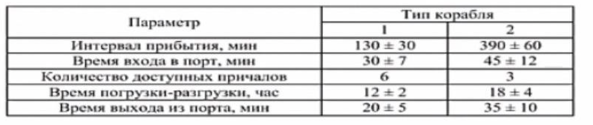

# Задание 17
Морские судна двух типов прибывают в порт, где происходит их разгрузка. В порту есть два буксира, обеспечивающих ввод и вывод кораблей из порта. К первому типу судов относятся корабли малого тоннажа, которые требуют использования одного буксира. Корабли второго типа имеют большие размеры, и для их ввода и вывода из порта требуется два буксира. Из-за различия размеров двух типов кораблей необходимы и причалы различного размера. Кроме того, корабли имеют различное время погрузки-разгрузки. Исходные данные приведены в таблице.

Построить модель системы, в которой можно оценить время ожидания кораблями каждого типа входа в порт. (Время ожидания входа в порт включает время ожидания освобождения причала и буксира). Корабль, ожидающий освобождения причала, не обслуживается буксиром до тех пор, пока не будет предоставлен нужный причал. Корабль второго типа не займет буксир до тех пор, пока ему не будут доступны оба буксира.