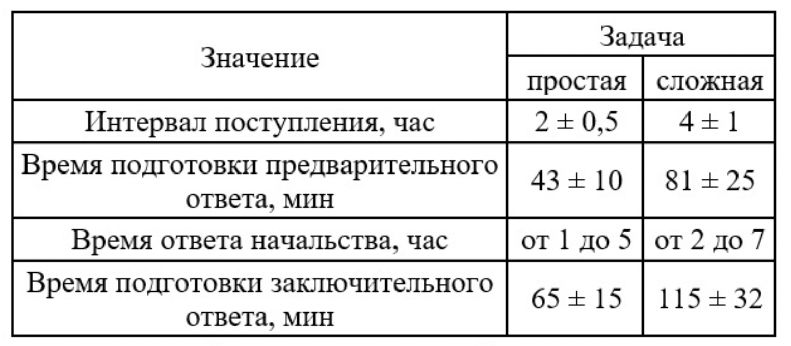

# Задание 32
Двум сотрудникам, занимающимся бюрократическими вопросами в некоторой организации, приходят задания от начальства разной сложности. Для решения простых задач достаточно одного сотрудника, для решения тяжелых задач требуется участие сразу обоих сотрудников. После получения задания, сотрудники сперва вникают в суть проблемы и готовят предварительный ответ и отправляют его обратно начальству по почте. После некоторого времени начальство присылает свой ответ с некоторыми замечаниями, и сотрудники вновь приступают к его выполнению. Данные об интервалах времени представлены в таблице.

Построить модель данной системы, в которой можно посмотреть сколько времени уходит на решение задач каждого типа. Предложить варианты решения проблемы если такая возникает.